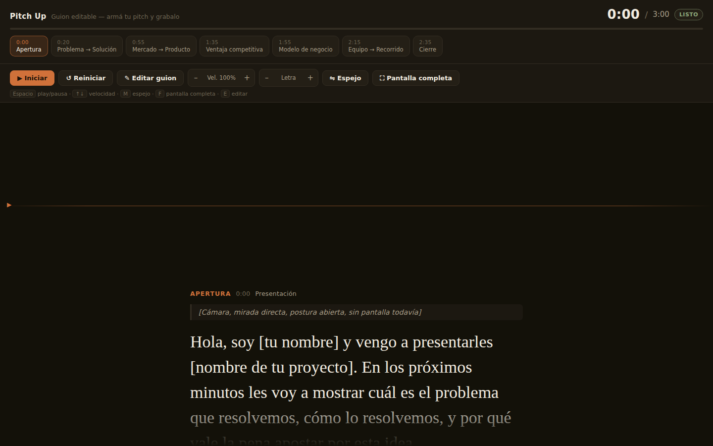

# Pitch Up 🎬

Teleprompter web con **guion editable desde la propia app**: scroll automático, control de velocidad, modo espejo, y un indicador de ritmo que compara tu avance real contra los tiempos objetivo de cada sección.

Un solo archivo HTML, sin dependencias ni build — abrilo en el navegador y listo. Se puede instalar como app (PWA) y usar sin conexión.



## Características

- **Editor de guion integrado** (botón "✎ Editar guion" o tecla `E`): agregá, reordená, editá o borrá secciones sin tocar una línea de código. Los cambios se guardan solos en el navegador.
- **Scroll automático** del guion, con velocidad ajustable a tu ritmo de lectura.
- **Acotaciones de cámara diferenciadas** del texto que se lee en voz alta.
- **Indicador de ritmo** ("En horario" / "Adelantado" / "Atrasado") que compara tu posición real de scroll contra el tiempo transcurrido. Es una guía orientativa, no una medición exacta — pasá el cursor sobre la etiqueta para ver la aclaración.
- **Adjuntar un guion ya escrito** en `.md`, `.txt` o `.json` en vez de tipearlo a mano: la app lo separa en secciones automáticamente.
- **Importar / exportar** el guion como JSON, para tener respaldo o compartirlo entre dispositivos.
- **Instalable como app (PWA)**: funciona offline una vez cargada una primera vez.
- **Modo espejo**, para usar con un vidrio de teleprompter físico.
- **Pantalla completa** para grabar sin distracciones, con aviso visible si el navegador la bloquea.
- Accesible: navegación por teclado, foco visible, anuncios de estado por lector de pantalla en el indicador de ritmo.

El guion que trae por defecto es una **plantilla de ejemplo** (Apertura, Problema → Solución, Mercado → Producto, Ventaja competitiva, Modelo de negocio, Equipo → Recorrido, Cierre) con placeholders entre corchetes — pensada para reemplazar por tu propio contenido desde el editor.

## Instalación y uso

### Opción 1 — Online, sin instalar nada (recomendado)

1. Andá a **Settings → Pages** en este repositorio.
2. En "Build and deployment", elegí **Deploy from a branch**, rama `main`, carpeta `/ (root)`, y guardá.
3. A los pocos minutos la app queda publicada en:
   `https://lucho-code.github.io/pitch_up/`
4. Abrí esa URL en el dispositivo que vas a usar para grabar (celular, tablet, laptop).
5. Opcional: desde el navegador elegí **"Instalar app" / "Agregar a pantalla de inicio"** para tenerla como app independiente, con ícono propio y funcionamiento sin conexión.

### Opción 2 — Local, en tu computadora

No requiere Node, ni instalación de paquetes, ni build. Alcanza con:

```bash
git clone https://github.com/Lucho-code/pitch_up.git
cd pitch_up
```

Y después abrir `index.html` con doble clic, o servirlo con cualquier servidor estático simple:

```bash
python3 -m http.server 8000
# abrí http://localhost:8000 en el navegador
```

(El service worker que habilita el uso offline solo se activa serviendo por `http(s)://` o `localhost` — abrir el archivo con doble clic funciona igual, pero sin esa capa offline extra.)

## Cómo usarlo para grabar

1. Presioná **✎ Editar guion** (o la tecla `E`) y reemplazá la plantilla de ejemplo por tu propio contenido: tocá **Duración total**, y en cada sección completá **Tiempo**, **Etiqueta**, **Subtítulo** y **Contenido**. Usá los botones **↑ ↓ ✕** para reordenar o borrar secciones, y **+ Agregar sección** para sumar nuevas. Guardá con **Guardar cambios**.
2. Ubicá la pantalla con Pitch Up justo al lado de (o superpuesta a) la cámara que va a grabar.
3. Presioná **▶ Iniciar** para arrancar el scroll automático.
4. Ajustá la **velocidad** con el slider (o `↑` `↓` del teclado) hasta encontrar tu ritmo natural de lectura.
5. Mirá el **indicador de ritmo** arriba a la derecha: te avisa en vivo si vas en horario respecto al guion.
6. Los bloques con fondo oscuro e itálica son **acotaciones de cámara** (ej. "[Cámara, mirada directa]") — no se leen en voz alta, son indicaciones de puesta en escena.
7. Usá los **chips de sección** para practicar un bloque puntual sin tener que rebobinar todo el guion.

### Escribir el contenido de una sección

En el campo **Contenido** del editor, escribí un párrafo por bloque, separados por una línea en blanco:

- Un párrafo normal se lee en voz alta.
- Un párrafo entre `[corchetes]` se muestra como acotación de cámara (no se lee).
- Un párrafo que empieza con `*` se muestra como nota para vos (tampoco se lee).

### Atajos de teclado

| Tecla | Acción |
|---|---|
| `Espacio` | Play / pausa |
| `↑` / `↓` | Subir / bajar velocidad |
| `M` | Modo espejo |
| `F` | Pantalla completa |
| `E` | Abrir editor de guion |
| `R` | Reiniciar |
| `Esc` | Cerrar editor |

## Adjuntar un guion ya escrito (.md / .txt / .json)

Si ya tenés el guion redactado en otro lado (Word, Google Docs exportado a texto, notas, etc.), no hace falta cargarlo sección por sección: guardalo como `.md` o `.txt` y subilo con **⭱ Adjuntar guion** en el editor.

- Si el documento tiene encabezados (`#`, `##` o `###`), cada encabezado arranca una sección nueva. El texto del encabezado admite hasta tres partes separadas por `|`: **Etiqueta | Tiempo (mm:ss) | Subtítulo** — tiempo y subtítulo son opcionales.

  ```markdown
  ## Apertura | 0:00 | Presentación
  [Cámara, mirada directa]
  Hola, soy [tu nombre] y vengo a presentarles...

  ## Problema → Solución | 0:20
  Hoy, [quién sufre el problema] enfrenta [el problema]...
  ```

  Si no ponés un tiempo, la sección arranca 20 segundos después de la anterior. El resto de las reglas de contenido (párrafo normal = se lee, `[entre corchetes]` = acotación de cámara, empieza con `*` = nota) son las mismas que en el editor.
- Si el documento **no tiene encabezados**, se importa entero como una única sección — igual podés separarla en varias después, a mano, desde el editor.
- Adjuntar reemplaza el guion actual, así que si querés conservar el que tenías, exportalo primero.

## Respaldar o compartir tu guion

El botón **⭳ Exportar** del editor descarga tu guion como archivo JSON, con toda la estructura (tiempos, subtítulos, bloques). El mismo botón **⭱ Adjuntar guion** también acepta un JSON exportado previamente (o compartido por otra persona) y lo carga tal cual, sin volver a separarlo en secciones. **Restaurar plantilla** vuelve a la plantilla de ejemplo original, por si querés empezar de cero.

Si preferís editar el guion directamente en el código en lugar de usar el editor visual, el contenido por defecto vive en el objeto `DEFAULT_DATA` dentro del `<script>` de `index.html`.

## Stack

HTML, CSS y JavaScript vanilla — sin frameworks, sin dependencias, sin paso de build. Un solo archivo (`index.html`) más un `manifest.json` y un `sw.js` mínimos para la instalación como PWA.
